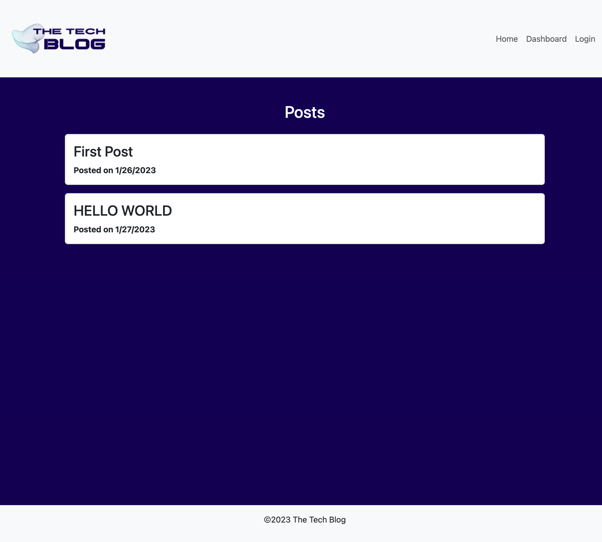

# Tech Blog

[Link to deployed application](https://thawing-gorge-80777.herokuapp.com/)

## Table of Contents
- [Description](#Description)
- [Usage](#Usage)
- [Visuals](#Visuals)

## Description
The Tech Blog is a CMS-style blog site where users can create blog posts and interact with other blog posts by commenting and sharing opinions. It also allows a user to update or delete their existing posts through an easy-to-access edit page. This application follows the MVC paradigm in its architectural structure, using Handlebars.js as the templating language, Sequelize as the ORM, and the express-session npm package for authentication.

## Usage
This application is deployed at this live [URL](https://thawing-gorge-80777.herokuapp.com/). When a user has accessed the web application via the URL, they can create an account. Once an account is created, the user will have the ability to create, edit, and delete blog posts, view other users' posts and comment on them, as well.

## Visuals

